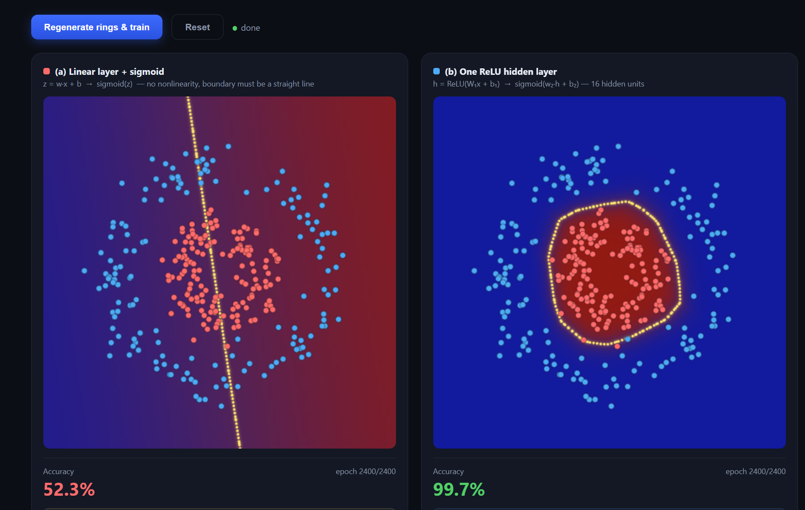

# Interactive Learning for Deep Learning Concepts

A single self-contained web app that proves four foundational deep learning claims by training
real (tiny) models live in the browser — no server, no backend, no ML library. Every chart,
equation, and accuracy number on the page is computed by gradient descent that runs the moment
you scroll to a module, using nothing but vanilla JavaScript and `<canvas>`.

## Screenshot



> **TODO:** drop a `screenshot.png` into this folder (e.g. the intro section with the four module
> cards, or one of the trained modules mid-animation) so it renders above. Any image viewer / the
> OS screenshot tool works — just keep the filename `screenshot.png` or update the path above.

## Running it

Open [`deep-learning-concepts-demo.html`](deep-learning-concepts-demo.html) directly in any modern
browser (double-click the file, or `file://` it) — there is no build step and no dependency to
install. If you'd rather serve it, any static file server works, e.g.:

```
npx serve .
```

## What's inside

It's a single scrolling page, not a multi-page app: an intro section up top with a short overview
and a card per module (click one to jump straight there), followed by the four modules in
sequence, each visually separated by a divider. Every module trains automatically the first time
it scrolls into view, and has two controls:

- **Regenerate & train** — re-rolls the random data and watches a fresh run from scratch.
- **Reset** — cancels any in-progress training and clears the module back to its idle state.

Each module also has a small footer nav to move **← Previous**, **↑ Top**, or **Next →** — the
first module has no Previous and the last has no Next.

| Module | Claim | What you watch |
| --- | --- | --- |
| **S1-1** · Activations exist for a reason | A model with no nonlinearity can only draw a straight decision boundary, so it can't separate two interleaved rings. One ReLU hidden layer fixes that. | A linear-+-sigmoid model stuck at ~55% accuracy next to a ReLU model that folds its boundary into a ring, reaching ~99–100%. |
| **S1-2** · Depth without nonlinearity is a lie | Stacking linear layers with no activation between them collapses algebraically into one linear map — depth alone buys nothing. | A 1-layer model and a 5-linear-layer model converge to the *same* line; the five trained weight matrices are then multiplied together live and shown to reproduce the network's output to floating-point precision (~1e-15). A same-sized 5-layer network *with* ReLU escapes the line and solves the task. |
| **S1-3** · Embeddings learn similarity from nothing but next-token | An embedding table trained only on "predict the next token" — no category labels — still clusters semantically related tokens together. | A tiny synthetic grammar (animals / fruits / verbs) trains a bigram embedding model; the learned embeddings are projected to 2D via live PCA and same-category tokens visibly cluster, with a nearest-neighbor check confirming it numerically. |
| **S1-4** · Memorization vs generalization | An over-parameterized model can drive train loss to ~0 on tiny data by memorizing noise; growing the dataset closes the train/test gap. | The same network trained on 20, 200, and 2000 noisy points — the decision boundary goes from contorting around individual points to a smooth curve, and a generalization-gap chart shows the train/test accuracy gap shrinking as N grows. |

## How each module is built

Every module follows the same three-part structure: a plain-English claim, a live experiment that
trains in front of you, and a proof panel that turns what you're watching into a concrete number
(an equation, a matrix-multiplication check, a nearest-neighbor tally, a gap measurement).

All the underlying machinery is written from scratch in the page's own `<script>` tag:

- **Seeded RNG** (`mulberry32`) so each run is reproducible from its seed, plus a Box-Muller
  Gaussian sampler for weight initialization.
- **Logistic regression and multi-layer perceptrons** with manual forward/backward passes
  (no autodiff library) — including a generic N-layer fully-connected stack (`makeStackModel` /
  `stackForward` / `stackTrainStep`) reused across the depth and generalization modules.
- **A bigram embedding language model** (embedding table → linear → softmax) trained with
  cross-entropy, used in the embeddings module.
- **Live PCA** via warm-started power iteration, so the 2D projection of the embedding table
  rotates smoothly across animation frames instead of jittering.
- **Canvas-based visualization**: decision boundaries are traced directly from the model's own
  predicted-probability grid (marching along p = 0.5), not drawn schematically.

## File structure

```
deep-learning-concepts-demo.html   the entire app — HTML, CSS, and JS in one file
README.md                          this file
screenshot.png                     (add this — see Screenshot section above)
```
